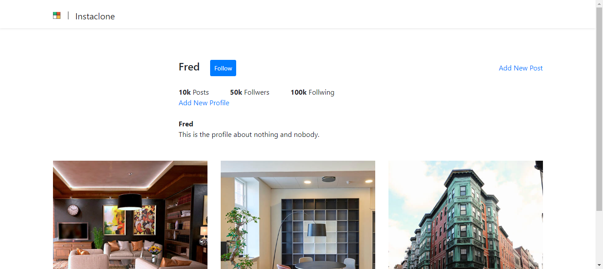

# Instagram Clone with Django

## Description

An Instagram clone built with Python Django that allows users to create accounts and posts. The application is responsive and enables users to share images.

## Features

- **Account Creation**: Users can register and create accounts.
- **Image Posting**: Ability to upload and share images.
- **Responsiveness**: Application is designed to be responsive across various devices.
- **Following Feature (Future Implementation)**: Feature to follow other users (not yet implemented).

## Setup Instructions

1. **Installation**: List any prerequisites and steps to install dependencies.
2. **Database Configuration**: Explain how to configure the database settings (using SQLite).
3. **Running the Application**: Provide instructions to run the Django server locally.

    ```bash
    python manage.py runserver
    ```

4. **Creating a Superuser**: Guide users on creating a superuser for admin access.

    ```bash
    python manage.py createsuperuser
    ```

5. **Usage**: Explain how to use the app, including user registration, creating posts, uploading images, etc.

## Technologies Used

- **Frontend**: Bootstrap for responsive design
- **Backend**: Django
- **Database**: SQLite

## Contributions

Specify guidelines for contributions if you're open to collaborators.

## Known Issues

It's not fully functional, but yeah, I'll probably get back to it when I have some time.

## screenshot


